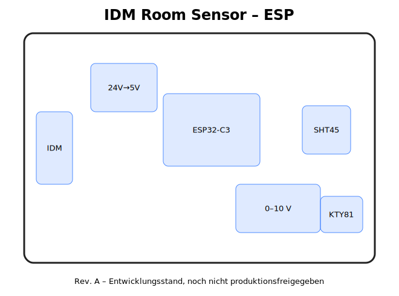
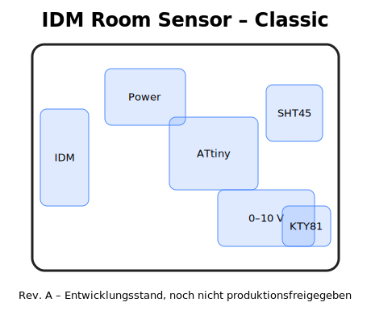
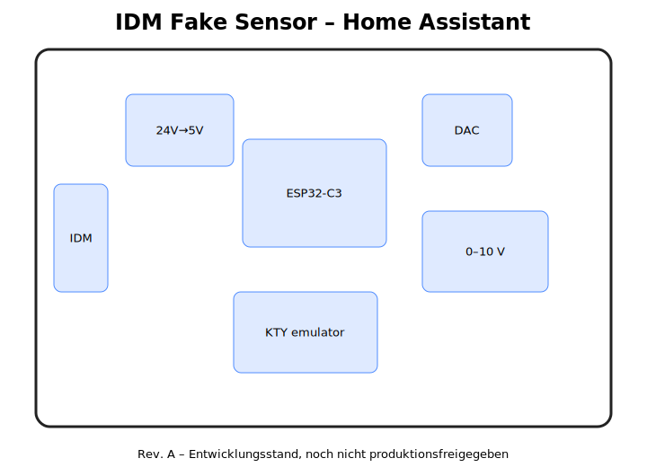

<div align="center">

# IDM Room Sensor

**Open-Hardware-Raumsensoren und Home-Assistant-Simulator für IDM AERO ALM / Navigator 2.0 & 10**

[](#projektstatus)
[](hardware/)
[](firmware/)
[](homeassistant/)
[](LICENSE)
[](firmware/LICENSE)

</div>

> [!WARNING]
> **Revision A ist ein Entwicklungsstand und nicht produktionsfreigegeben.**  
> Schaltplan, Footprints, Routing, Schutzbeschaltung, Kennlinien und Kalibrierung müssen vor Fertigung und Anschluss geprüft werden.

## Projektidee

Das Repository bündelt drei Ansätze für den kombinierten IDM-Raumtemperatur- und Feuchtesensor:

| Variante | Messung | Home Assistant | IDM-Ausgabe | Einsatzzweck |
|---|---|---:|---|---|
| **ESP Sensor** | SHT45 + echter KTY81-210 | ✅ ESPHome | 0–10 V + KTY81-210 | Smarter echter Raumsensor |
| **Classic Sensor** | SHT45 + echter KTY81-210 | ❌ | 0–10 V + KTY81-210 | Kleiner Ersatz ohne WLAN |
| **Fake Sensor** | Werte aus HA | ✅ ESPHome | 0–10 V + KTY-Simulation | Kritischsten Raum an IDM melden |

## Hardwarevarianten

### ESP Sensor

Der ESP32-C3 wird direkt aus den 24 V der IDM versorgt. Ein SHT45 misst Temperatur und Feuchte, Home Assistant erhält die Messwerte per ESPHome. Die IDM bekommt den Feuchtewert als 0–10-V-Signal; die Temperatur wird durch einen echten KTY81-210 bereitgestellt.



[Hardware öffnen](hardware/esp-sensor/) · [ESPHome-Konfiguration](firmware/esp-sensor-esphome.yaml)

### Classic Sensor

Kompakte Stand-alone-Version ohne WLAN. Ein kleiner Mikrocontroller liest den SHT45 und erzeugt das analoge Feuchtesignal. Die Temperatur wird wieder über einen echten KTY81-210 gemeldet.



[Hardware öffnen](hardware/classic-sensor/)

### Fake Sensor

Diese Version empfängt Temperatur und Feuchte aus Home Assistant und verhält sich elektrisch wie der vorgesehene IDM-Sensor. Dadurch kann die Anlage beispielsweise den **höchsten Feuchtewert** oder den **kritischsten Taupunkt** aus mehreren Räumen berücksichtigen.



[Hardware öffnen](hardware/fake-sensor/) · [HA-Automation](homeassistant/fake-sensor-automation.yaml)

## Vorgesehener IDM-Anschluss

| IDM-Klemme | Funktion |
|---:|---|
| **42** | +24 V Versorgung |
| **43** | GND |
| **40** | relative Feuchte, vorläufig 0–10 V |
| **72** | Temperatur / KTY81-210 |
| **73** | Temperatur-Rückleiter |

Aktuelle Arbeitsannahme:

```text
0 V  =   0 % relative Feuchte
5 V  =  50 % relative Feuchte
10 V = 100 % relative Feuchte
```

Diese Kennlinie muss vor dem produktiven Einsatz am Originalsensor oder direkt an der IDM-Regelung bestätigt werden.

## Versorgung

```text
IDM 24 V
   │
   ├── Schutzbeschaltung
   ├── 24 V → 5 V
   └── 5 V → 3,3 V
             ├── ESP32-C3 / ATtiny
             ├── SHT45
             └── DAC
```

Die ESP- und Fake-Sensor-Version benötigen **kein separates Netzteil**.

## Fail-safe des Fake Sensors

Bei fehlenden Updates aus Home Assistant soll die Platine konservative Ersatzwerte ausgeben. Der aktuelle Beispielstand verwendet:

- **80 % relative Feuchte**
- **28 °C simulierte Temperatur**
- Timeout: **120 Sekunden**

Für den Kühlbetrieb sollte zusätzlich ein unabhängiger Taupunktwächter aktiv bleiben.

## Repository-Struktur

```text
.
├── hardware/
│   ├── esp-sensor/
│   ├── classic-sensor/
│   └── fake-sensor/
├── firmware/
├── homeassistant/
├── docs/
│   ├── images/
│   ├── hardware.md
│   ├── installation.md
│   └── safety.md
├── .github/
│   ├── ISSUE_TEMPLATE/
│   ├── workflows/
│   └── pull_request_template.md
├── CONTRIBUTING.md
├── LICENSE
└── README.md
```

## Projektstatus

- [x] Grundkonzept und Anschlussbelegung
- [x] Drei Hardwarevarianten angelegt
- [x] KiCad-Projektdateien und Boardkonturen
- [x] ESPHome- und Home-Assistant-Beispiele
- [x] 3D-Druckgehäuse als STL und OpenSCAD
- [ ] Originale Feuchtekennlinie verifizieren
- [ ] KTY81-210-Eingang der IDM vermessen
- [ ] Schaltpläne elektrisch prüfen
- [ ] Vollständiges PCB-Routing und DRC
- [ ] Ersten Prototyp fertigen
- [ ] Kalibrierung und Langzeittest
- [ ] Produktionsdaten freigeben

## Dokumentation

- [Hardwareübersicht](docs/hardware.md)
- [Installation und Sensorposition](docs/installation.md)
- [Sicherheit und Validierung](docs/safety.md)
- [Kalibrierung des Fake Sensors](hardware/fake-sensor/CALIBRATION.md)

## Mitmachen

Fehlerberichte, Messwerte des Originals, Fotos der IDM-Platine und getestete Kennlinien sind besonders hilfreich. Bitte vor Änderungen [CONTRIBUTING.md](CONTRIBUTING.md) lesen.

## Lizenz

Hardwaredateien stehen unter **CERN-OHL-S-2.0**. Firmware und Konfigurationsbeispiele stehen unter der **MIT-Lizenz**. Details befinden sich in den jeweiligen Lizenzdateien.

## Haftungsausschluss

Dieses Projekt ist nicht mit IDM Energiesysteme verbunden und kein offizielles IDM-Produkt. Arbeiten an Wärmepumpen und elektrischen Anlagen dürfen nur fachgerecht erfolgen. Nutzung und Nachbau erfolgen auf eigene Verantwortung.
